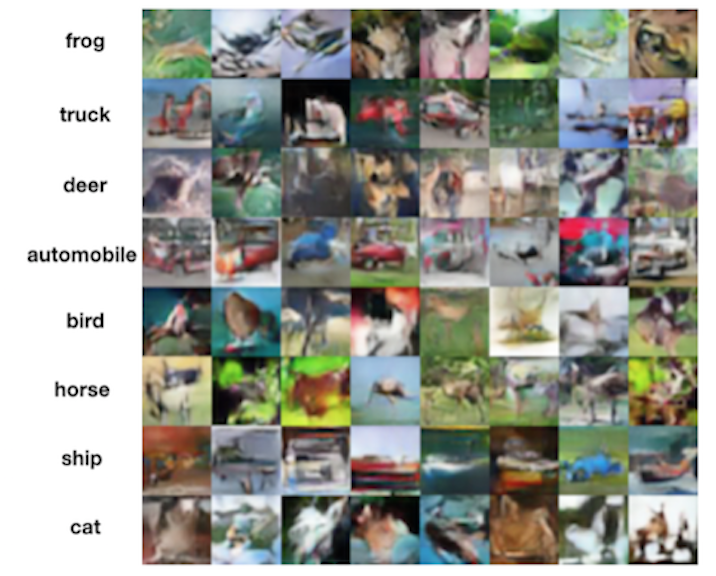
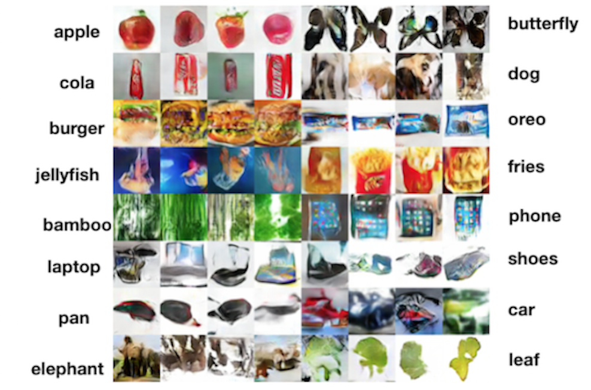

# calphagan
## Brief Introduction
We run this script under TensorFlow 1.4 and the TensorLayer 1.8.0+. The proposed model integrates conditional GAN and recently introduced alpha-GAN architecture, aiming at solving the image generation problem conditioned on brain signal.

alpha-GAN: [Variational Approaches for Auto-Encoding Generative Adversarial Networks](https://arxiv.org/abs/1706.04987)

conditional GAN: [Conditional Generative Adversarial Nets](https://arxiv.org/abs/1411.1784)

## Network Architecture
### Encoder
<div align="center">
	
</div>
</a>

### CodeDiscriminator
<div align="center">
	
</div>
</a>

### Generator
<div align="center">
	
</div>
</a>

### Discriminator
<div align="center">
	
</div>
</a>

## Data
### Save image data into TFRecord format
In this script, we read the image data, and save them into TFRecord format using the following method.
```bash
load_and_save_to_tfrecord(data_dir, save_dir, name)
```
data_dir should contain the folders named by the class labels, and each folder contains the images in JPEG format. Finally the data would be saved into the save_dir with the given name.

### Read TFRecord during training
The data is read from TFRecord from following API.
```bash
input_batch(filename, batch_size, num_epochs, shuffle_size, is_augment)
```
filename is the TFRecord file storing all the images and corresponding label.
is_augment is a boolean type parameter to choose use augmentation method or not. The return of this method is a batch of images and their labels.

## Run
To successfully run the code, please firstly set up all the configurations in `god_config.py`, such as the TFRecord file directory 
```bash
config.data_tfrecord_dir = './train/cifar10_labeled.tf'
```
and other tunable hyper-parameters.

There are three modes to train the networks and evaluate the results respectively.
### Train
The train mode is used to train the whole network, including generator, encoder, discriminator and code discriminator. Simply using the following command on terminal.
```bash
python main.py
```
### Encode
The encode mode uses well-trained encoder to encode the provided images under train_samples.
```bash
images_dir = './train_samples'
```
To run this mode, you can simply use the following command on terminal.
```bash
python main.py --mode=encode
```

### Generate
The generate mode uses well-trained generator to generate the reconstructed images from given predicted features and labels, which is stored in following path
```bash
'./results/encoded_feat.pkl'
```
To run this mode, you can simply use the following command on terminal.
```bash
python main.py --mode=gen
```

## Results
### Test on CIFAR-10
<div align="center">
	
</div>
</a>
### Test on random constructed dataset
<div align="center">
	
</div>
</a>
