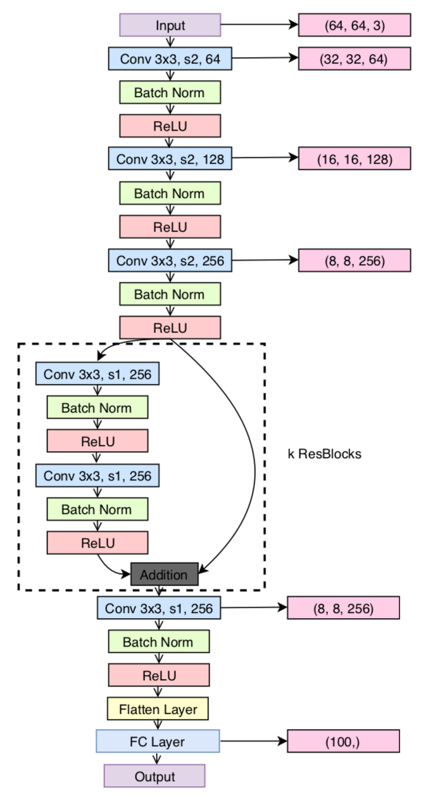
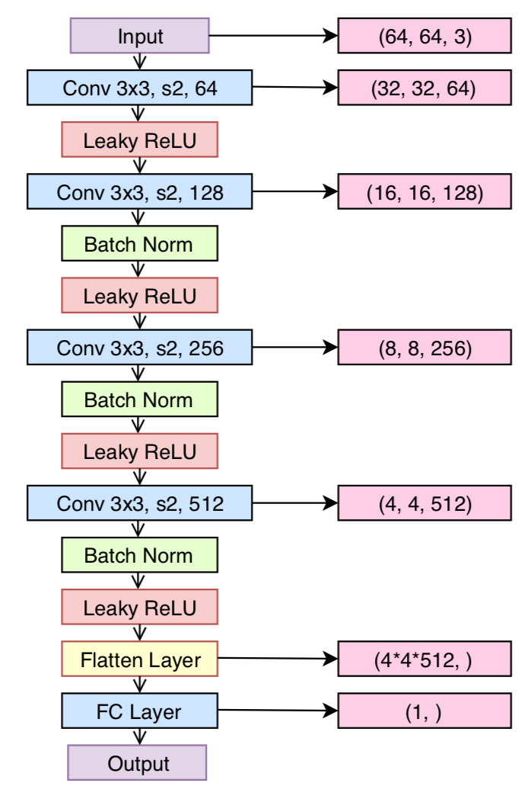

# calphagan
## Brief Introduction
We run this script under TensorFlow 1.4 and the TensorLayer 1.8.0+. The proposed model integrates conditional GAN and recently introduced alpha-GAN architecture, aiming at solving the image generation problem conditioned on brain signal.

alpha-GAN: [Variational Approaches for Auto-Encoding Generative Adversarial Networks](https://arxiv.org/abs/1706.04987)

conditional GAN: [Conditional Generative Adversarial Nets](https://arxiv.org/abs/1411.1784)

## Network Architecture
### Encoder

	

</a>

### Code Discriminator

	

</a>

### Generator

	

</a>
### Discriminator

	

</a>
