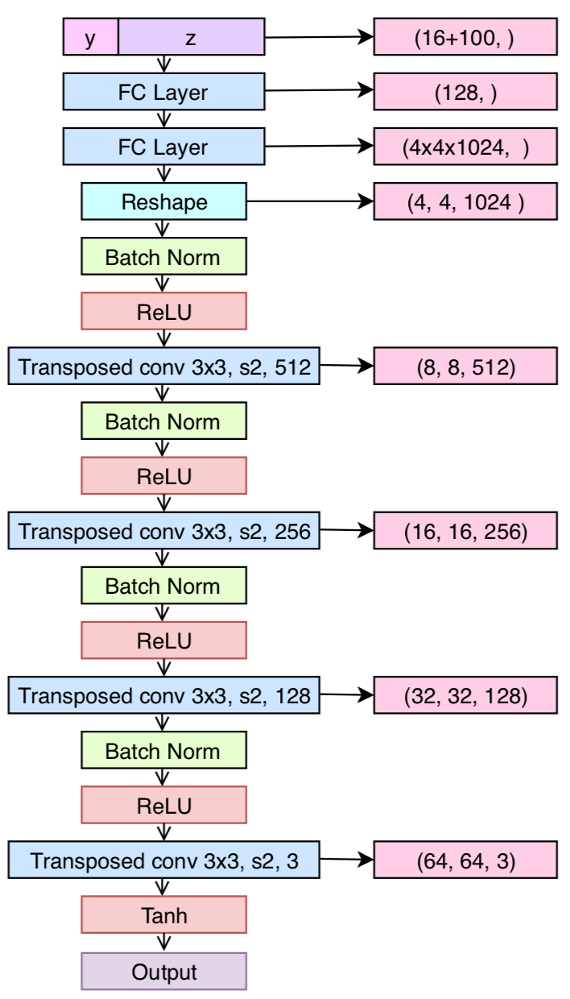

# calphagan
## Brief Introduction
We run this script under TensorFlow 1.4 and the TensorLayer 1.8.0+. The proposed model integrates conditional GAN and recently introduced alpha-GAN architecture, aiming at solving the image generation problem conditioned on brain signal.

alpha-GAN: [Variational Approaches for Auto-Encoding Generative Adversarial Networks](https://arxiv.org/abs/1706.04987)

conditional GAN: [Conditional Generative Adversarial Nets](https://arxiv.org/abs/1411.1784)

## Network Architecture
### Encoder
<div align="center">
	
</div>
</a>

### CodeDiscriminator
<div align="center">
	
</div>
</a>

### Generator
<div align="center">
	
</div>
</a>

### Discriminator
<div align="center">
	
</div>
</a>

## Data
### Save image data into TFRecord format
In this script, we read the image data, and save them into TFRecord format using the following method.
```bash
load_and_save_to_tfrecord(data_dir, save_dir, name)
```
data_dir should contain the folders named by the class labels, and each folder contains the images in JPEG format. Finally the data would be saved into the save_dir with the given name.

